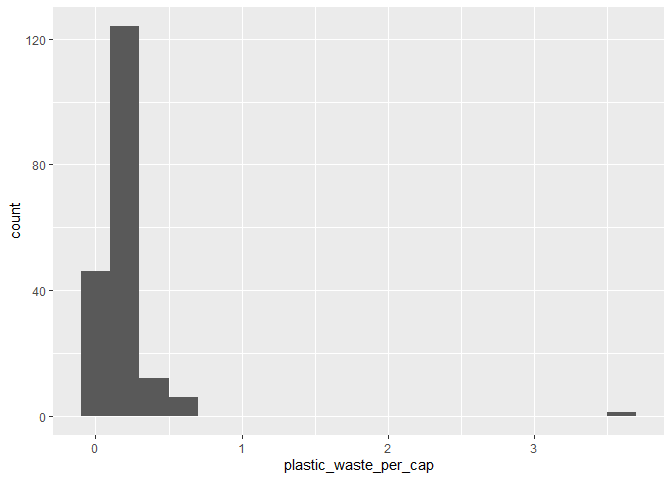
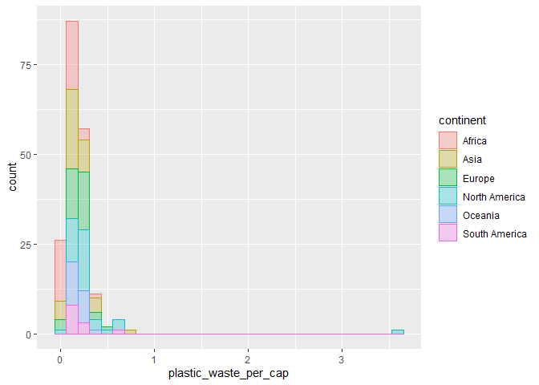
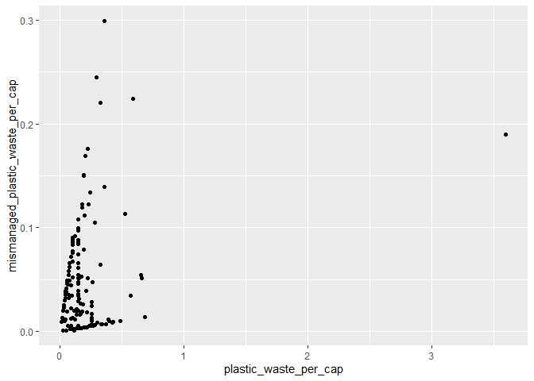

Lab 02 - Plastic waste
================
Cat Seitz
01/16/23

## Load packages and data

``` r
library(tidyverse) 
library(ggplot2)
library(viridis)
```

``` r
plastic_waste <- read.csv("data/plastic-waste.csv")
```

## Exercises

### Exercise 1

Remove this text, and add your answer for Exercise 1 here.

``` r
ggplot(data = plastic_waste, aes(x = plastic_waste_per_cap)) +
  geom_histogram(binwidth = 0.2)
```

    ## Warning: Removed 51 rows containing non-finite values (`stat_bin()`).

<!-- -->

``` r
plastic_waste %>%
  filter(plastic_waste_per_cap > 3.5)
```

    ##   code              entity     continent year gdp_per_cap plastic_waste_per_cap
    ## 1  TTO Trinidad and Tobago North America 2010    31260.91                   3.6
    ##   mismanaged_plastic_waste_per_cap mismanaged_plastic_waste coastal_pop
    ## 1                             0.19                    94066     1358433
    ##   total_pop
    ## 1   1341465

I wasn’t expecting this result, but upon further investigation, I found
that Trinidad and Tobago has inefficient waste management systems and
the households don’t segregate waste.

``` r
ggplot(data = plastic_waste, 
       mapping = aes(x = plastic_waste_per_cap, 
                     color = continent, 
                     fill = continent)) +
  geom_histogram(alpha = 0.7)
```

    ## `stat_bin()` using `bins = 30`. Pick better value with `binwidth`.

    ## Warning: Removed 51 rows containing non-finite values (`stat_bin()`).

<!-- -->

### Exercise 2.1

``` r
ggplot(data = plastic_waste, 
       mapping = aes(x = plastic_waste_per_cap, 
                     color = continent, 
                     fill = continent)) +
  geom_histogram(alpha = 0.3)
```

    ## `stat_bin()` using `bins = 30`. Pick better value with `binwidth`.

    ## Warning: Removed 51 rows containing non-finite values (`stat_bin()`).

<!-- --> \###
Exercise 2.2

The color and fill are defined by the continent so the dataframe gets
grouped that way instead of all of the continents grouped together, but
alpha is a function of the entire graph.

``` r
ggplot(data = plastic_waste, 
       mapping = aes(x = continent, 
                     y = plastic_waste_per_cap)) +
  geom_boxplot()
```

    ## Warning: Removed 51 rows containing non-finite values (`stat_boxplot()`).

<!-- -->

### Exercise 3.1

Violin plots show the density of the distribution as well as all of the
elements of the box plot.

``` r
ggplot(data = plastic_waste, 
       mapping = aes(x = continent, 
                     y = plastic_waste_per_cap)) +
  geom_violin()
```

    ## Warning: Removed 51 rows containing non-finite values (`stat_ydensity()`).

<!-- -->

### Exercise 4.1

``` r
ggplot(data = plastic_waste, 
       mapping = aes(x = plastic_waste_per_cap,
                     y = mismanaged_plastic_waste_per_cap)) +
  geom_point()
```

    ## Warning: Removed 51 rows containing missing values (`geom_point()`).

<!-- -->
There seems to be a positive correlation between between plastic waste
per capita and mismanaged waste per capita.

### Exercise 4.2

``` r
ggplot(data = plastic_waste, 
       mapping = aes(x = plastic_waste_per_cap,
                     y = mismanaged_plastic_waste_per_cap, 
                     color=continent))+
  geom_point()
```

    ## Warning: Removed 51 rows containing missing values (`geom_point()`).

<!-- -->
It’s somewhat hard to tell because most of the data points are confined
to the same area, but it looks like some continents have steeper
relationships between plastic waste per capita and mismanaged waste per
capita. If I has to speculate, Europe has a less steep relationship and
Africa has a more steep relationship.

### Exercise 4.3

``` r
ggplot(data = plastic_waste, 
       mapping = aes(x = total_pop,
                     y = plastic_waste_per_cap))+
  geom_point()
```

    ## Warning: Removed 61 rows containing missing values (`geom_point()`).

<!-- -->

``` r
ggplot(data = plastic_waste, 
       mapping = aes(x = coastal_pop,
                     y = plastic_waste_per_cap))+
  geom_point()
```

    ## Warning: Removed 51 rows containing missing values (`geom_point()`).

<!-- -->
Plastic waste per capita and coastal population seem to be more linearly
associated than plastic waste per capita and total population, but,
again, it’s difficult to tell just from these scatterplots.

### Exercise recreate plot

``` r
plastic_waste <- transform(
  plastic_waste, coastal_pop_proportion= plastic_waste$coastal_pop/plastic_waste$total_pop
)
```

``` r
ggplot(plastic_waste[which(plastic_waste$plastic_waste_per_cap<3.5),],
       mapping = aes(x = coastal_pop_proportion,
                     y = plastic_waste_per_cap))+
  geom_point(aes(color=continent))+
  geom_smooth(color="#000000")+
  scale_color_viridis(discrete=TRUE)+
  
  labs(title = "Plastic waste vs. coastal population proportion", subtitle = "by continent")+
  labs(x = "Coastal population proportion (Coastal/total population)", y = "Plastic waste per capita")
```

    ## `geom_smooth()` using method = 'loess' and formula = 'y ~ x'

    ## Warning: Removed 10 rows containing non-finite values (`stat_smooth()`).

    ## Warning: Removed 10 rows containing missing values (`geom_point()`).

<!-- -->
